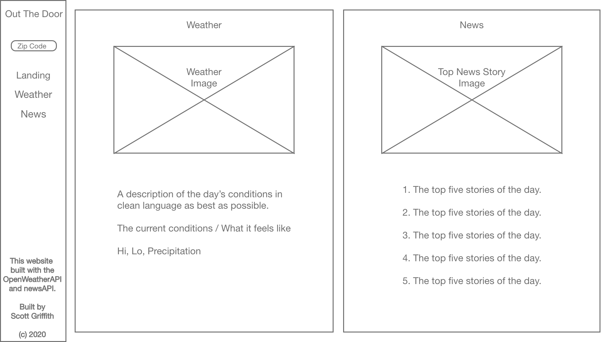
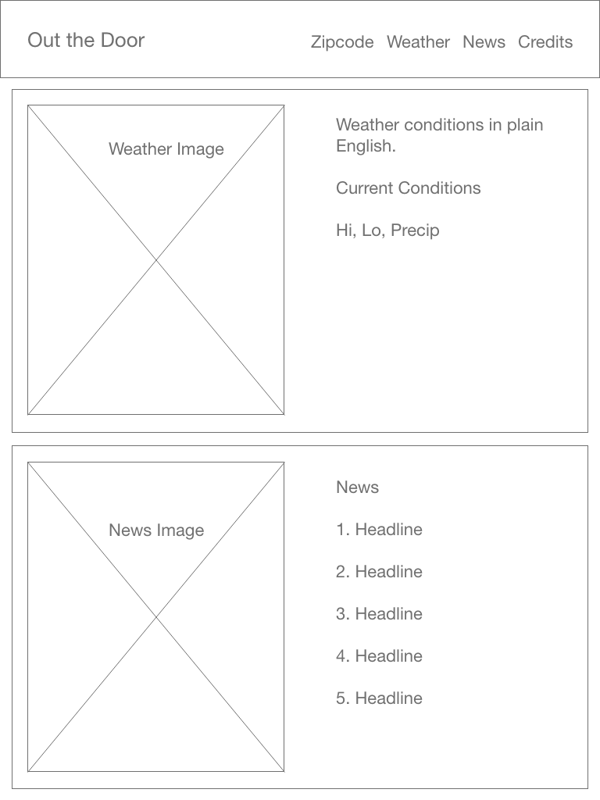
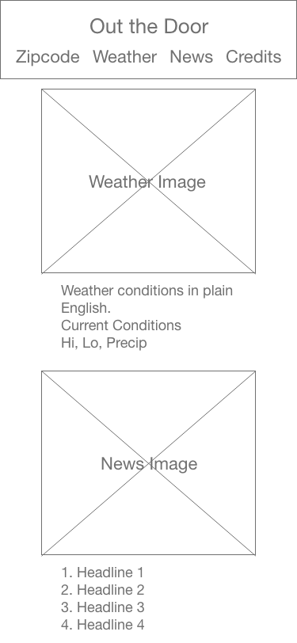

# **"Out The Door"** by Scott Griffith
 

## The App

This app will be called Out The Door as in the last thing you see on your way out the door.

For the past couple of years, I've been concerned about Internet of Things devices and the inherent non-ownership present in relying on a company like Google or Amazon to provide content.  Instead, I want a device that pulls data in browser and displays it on a small dedicated screen located right by my apartment door, with the day's information.

I want a simplified news reader and weather app that boils down the days conditions into "what do I actually need to know?"  While you can expand stories and weather slightly, the overriding protocol is simplicity.  There is not an endless list of stories you can scroll.  I think feeds are problematic.  There will always be more information.  This is an edit.

## Wireframes:
### Desktop and Landscape Tablet Wireframe:  

### Portrait Tablet Wireframe:

### Phone Wireframe:

## APIs
- Weather: https://openweathermap.org/api
- News: https://newsapi.org/

## Open Source Assets
- Weather Icons: https://github.com/erikflowers/weather-icons

## MVP
- Reliably pull from APIs and present concise and clear information.
- Present weather in a friendly and minimalist fashion
- Present only the headlines and not send readers down a feed rabbithole.
- Use flexbox to dynamically resize the information.

## Post-MVP, Proposed
- After initial zipcode request, store that in a cookie locally.
- If NYC zipcode is detected, possibly add the MTA javascript widget (though it's ugly).
- Light and Dark mode depending on time of day and sunrise/sunset.
- Option to replace news with a todo list.

## Post-MVP, Actual
- Instead of using local storage, I created a geolocation module that fed simplified latitude and longitude (Accurate to neighborhood, not address) to a weather service.
- Reformatted code to force an HTTPS connection so that geolocation could be utilized.
- Changed design goals to be responsive on pretty much any device.

## Post-Project Design Goals
- The option to change the weather to Celcius.  I'm figuring out the coding necessary to do this and how that option would be presented.  Mostly, I want the option to be unobtrusive, easy to understand, and persistent, so I'm going to need to dig into local storage to save that information.